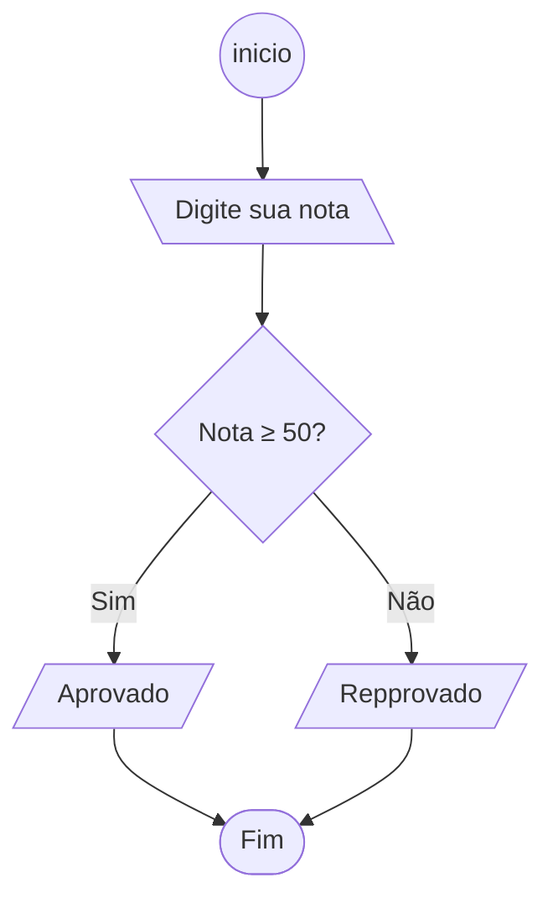

```mermaid
    flowchart TD
%% TD = Top to bottom ^
        start((inicio)) --> input[\Digite sua nota\] 
%%(()) == círculo
        input --> verification{Nota ≥ 50?}
        verification --> |Sim| A[/ Aprovado /]
        verification --> |Não| B[/ Repprovado /]
        A --> finish([ Fim ])
        B --> finish
```