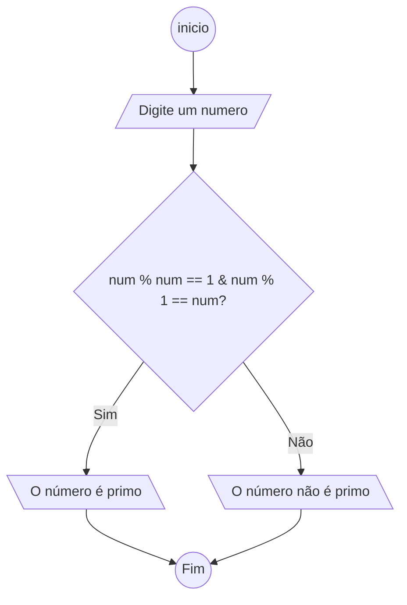

```mermaid
    flowchart TD
    start((inicio)) --> input[/Digite um numero/]
    input --> verification{num % num == 1 & num % 1 == num?}

     verification --> |Sim| S[\O número é primo\]
     verification --> |Não| N[\O número não é primo\]

     S --> finish(( Fim ))
     N --> finish 
```