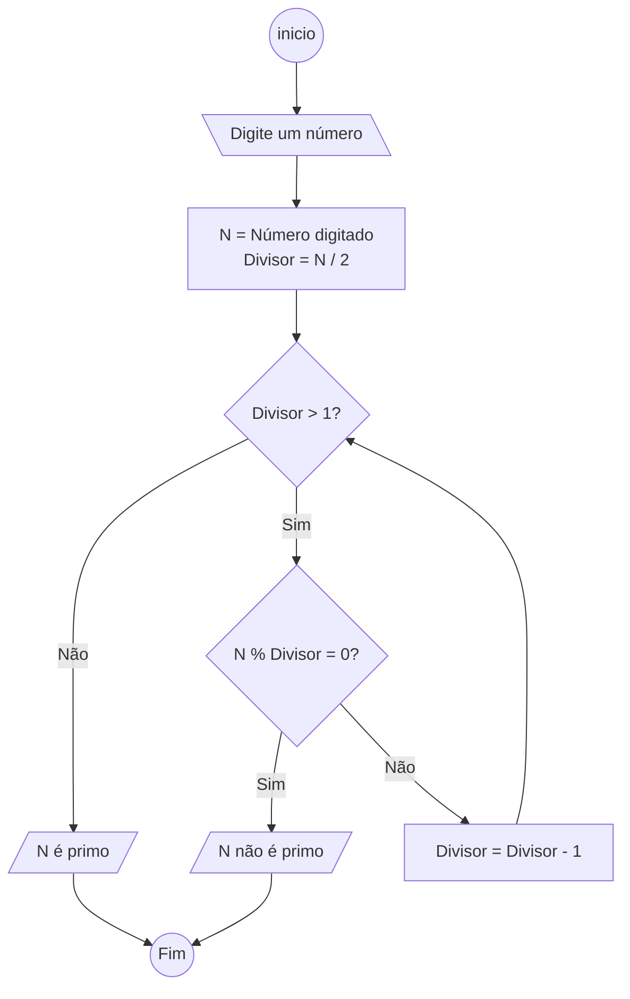

```mermaid
    flowchart TD
    start((inicio)) --> input[\Digite um número\]
    input --> div[N = Número digitado
    Divisor = N / 2]
    div --> verification{Divisor > 1?}

     verification --> |Sim| verificar{N % Divisor = 0?}
     verification --> |Não| primo[/N é primo/]
     verificar --> |Sim| N[/N não é primo/]
     verificar --> |Não| S[Divisor = Divisor - 1]
     S --> verification

     primo --> finish(( Fim ))
     N --> finish 
```