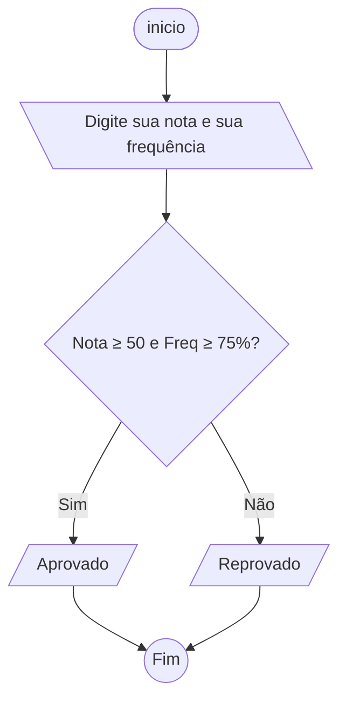

```mermaid
    flowchart TD
%% TD = Top to down(bottom) ^

        start([inicio]) --> input[\Digite sua nota e sua frequência\] 

%%(()) == círculo
        input --> verification{Nota ≥ 50 e Freq ≥ 75%?}

        verification --> |Sim| A[/ Aprovado /]
        verification --> |Não| B[/ Reprovado /]
        
        A --> finish(( Fim ))
        B --> finish
```