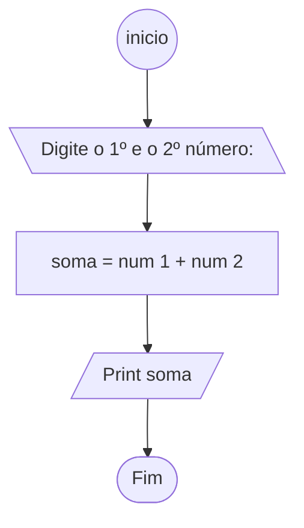

```mermaid
    flowchart TD
        start((inicio)) --> input[\ Digite o 1º e o 2º número: \]
        input --> verification[soma = num 1 + num 2]
        verification --> Fim[/Print soma/]
        Fim --> finish([ Fim ])
```