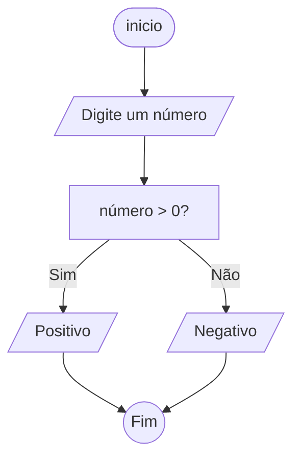

```mermaid
    flowchart TD
    start([inicio]) --> input[/Digite um número/]
    input --> verification[número > 0?]

    verification --> |Sim| pos[/Positivo/]
    verification --> |Não| neg[/Negativo/]

    pos --> finish(( Fim ))
    neg --> finish

```