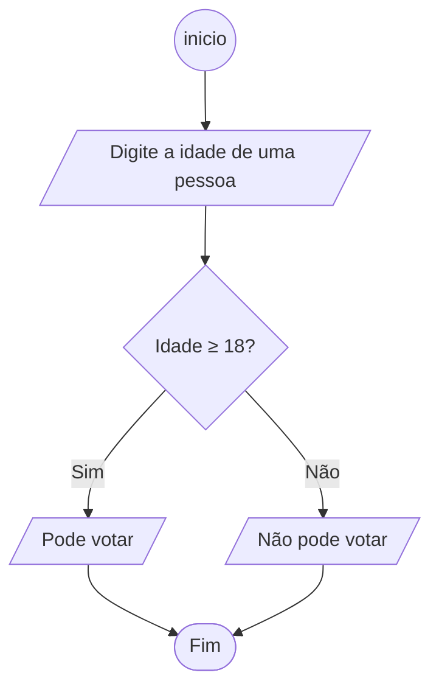

```mermaid
    flowchart TD

    start((inicio)) --> input[/Digite a idade de uma pessoa/]
    input --> verification{Idade ≥ 18?}

    verification --> |Sim| A[/ Pode votar /]
    verification --> |Não| R[/ Não pode votar /]
    A --> finish([ Fim ])
    R --> finish
```