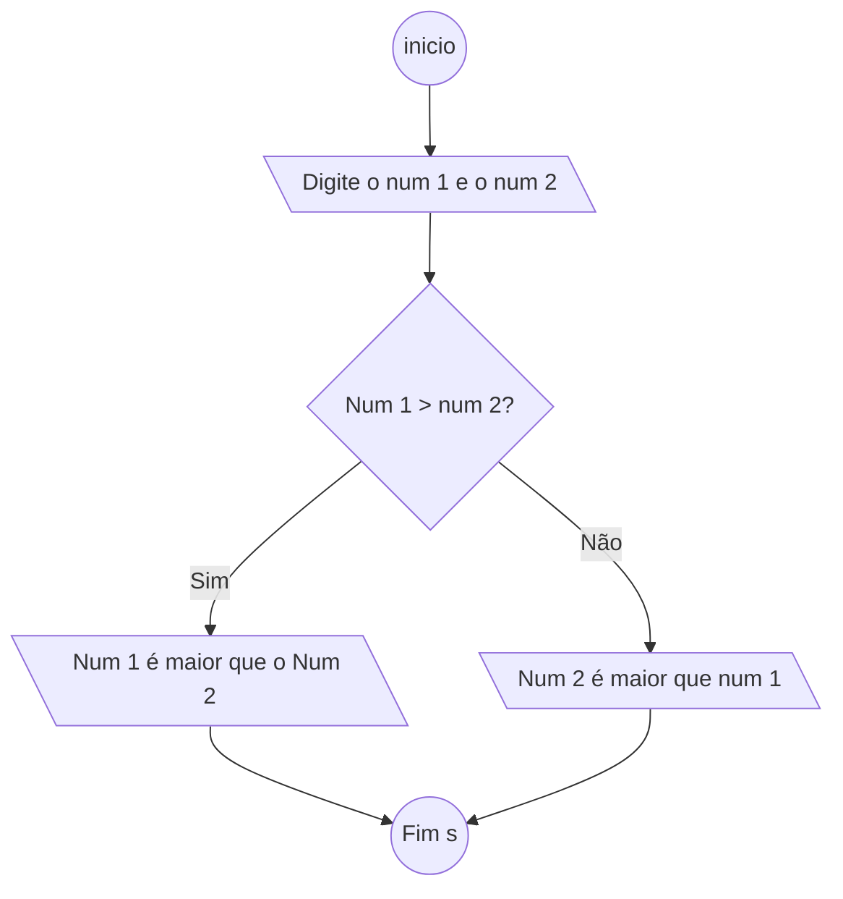

```mermaid
    flowchart TD

    start((inicio)) --> input[\Digite o num 1 e o num 2\]
    input --> verification{Num 1 > num 2?}

    verification --> |Sim| S[\Num 1 é maior que o Num 2\]
    verification --> |Não| N[\Num 2 é maior que num 1\]
    S --> finish(( Fim s))
    N --> finish
```