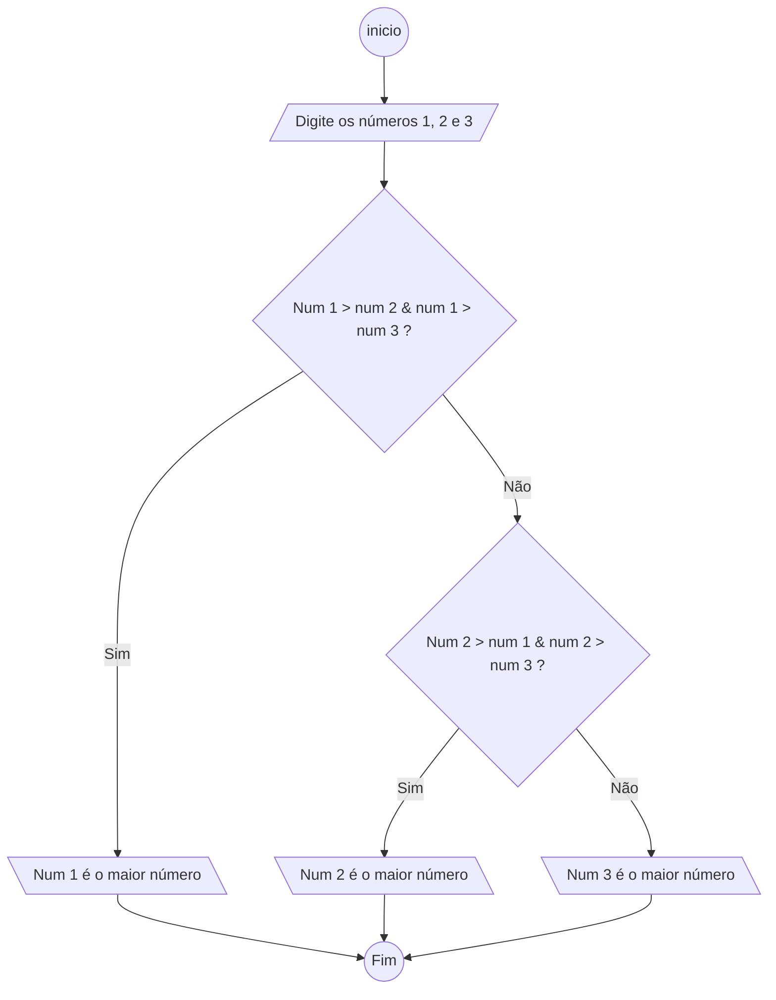

```mermaid
    flowchart TD
    
    start((inicio)) --> input[/Digite os números 1, 2 e 3/]
    input --> verification{Num 1 > num 2 & num 1 > num 3 ?} 

    verification --> |Sim| U[\Num 1 é o maior número\]
    verification --> |Não| verification2{Num 2 > num 1 & num 2 > num 3 ?}
    verification2 --> |Sim| D[\Num 2 é o maior número\]
    verification2 --> |Não| T[\Num 3 é o maior número\]
    
    U --> finish(( Fim ))
    D --> finish 
    T --> finish
```