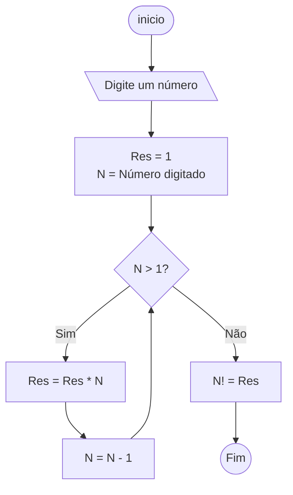

```mermaid
    flowchart TD
    start([inicio]) --> input[\Digite um número\] 
    input --> fat[Res = 1
    N = Número digitado]
    fat --> verification{ N > 1?}

    verification --> |Sim| f[Res = Res * N]
    f --> m[N = N - 1] --> verification
    verification --> |Não| n[N! = Res]

    n --> finish((Fim))
```