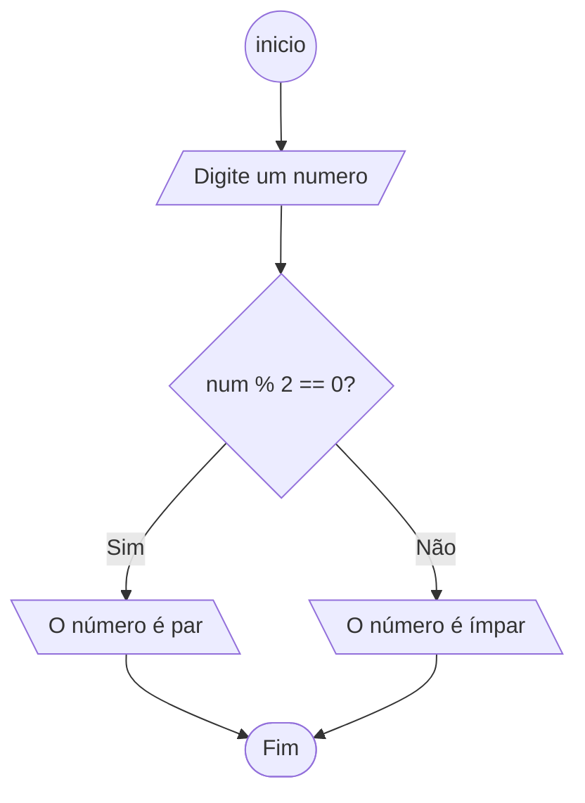

```mermaid
    flowchart TD
    start((inicio)) --> input[/Digite um numero/]
    input --> verification{num % 2 == 0?}

     verification --> |Sim| S[\O número é par\]
     verification --> |Não| N[\O número é ímpar\]

     S --> finish([Fim])
     N --> finish
```